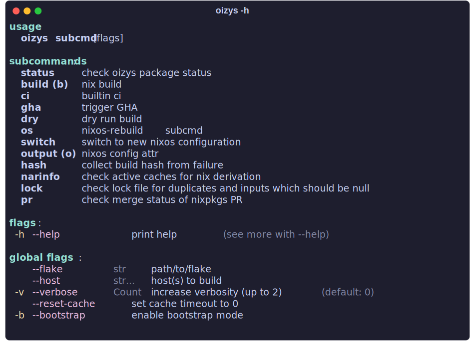

<div align="center">
<h1>oizys</h1>
<p>nix begat oizys</p>
</div>

This is a custom multi-host [nixos](https://nixos.org) flake.
See below for the currently maintained hosts.

## hosts

<table>
  <tr>
    <th>rune</th>
    <th>name</th>
    <th>system</th>
  </tr>
<tr>
  <td>
     
  </td>
  <td>othalan</td>
  <td>Thinkpad Carbon X1 Gen 9</td>
</tr>
<tr>
  <td>
    
  </td>
  <td>algiz</td>
  <td>Hetzner VPS hosting forgejo, soft-serve & gts</td>
</tr>
<tr>
  <td>
    
  </td>
  <td>mannaz</td>
  <td>Custom AMD Tower with Nvidia 1050ti</td>
</tr>
<tr>
  <td>
    
  </td>
  <td>naudiz</td>
  <td>Nixos-WSL for those times I'm trapped on windows</td>
</tr>
</table>

## oizys cli

A small helper utility that mostly just wraps `nix` commands for convenience.

```sh
nix run "github:daylinmorgan/oizys"
```



## user dotfiles

Dotfiles are managed with [`chezmoi`](https://chezmoi.io).

### Install

from Source:

```bash
sh -c "$(curl -fsLS https://chezmoi.io/get)" -- init --apply git.dayl.in/daylin/oizys -S ~/oizys --ssh
```

from Github:

```bash
sh -c "$(curl -fsLS https://chezmoi.io/get)" -- init --apply daylinmorgan/oizys -S ~/oizys --ssh
```

with Nix:

```bash
nix run "nixpkgs#chezmoi" -- init --apply daylinmorgan/oizys -S ~/oizys
```

## Relevant XKCD

<p align="center">

</p>

## oizys?

Oizys was birthed by the goddess Nyx/Nix and embodies suffering and misery. Which is all that awaits you if you embrace nix.
