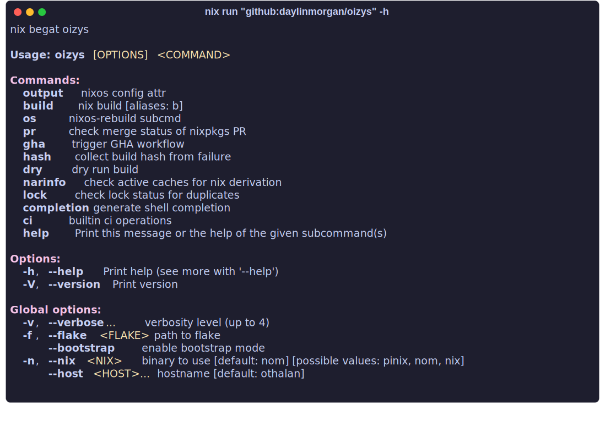

<div align="center">
<h1>oizys</h1>
<p>nix begat oizys</p>
</div>

This is my custom multi-host [nixos](https://nixos.org) flake for servers, desktops, and WSL.

## oizys cli

A small helper utility that mostly just wraps `nix` commands for convenience.

```sh
nix run "github:daylinmorgan/oizys"
```



## user dotfiles

Dotfiles are managed with [`chezmoi`](https://chezmoi.io).

### Install

from Source:

```bash
sh -c "$(curl -fsLS https://chezmoi.io/get)" -- init --apply git.dayl.in/daylin/oizys -S ~/oizys --ssh
```

from Github:

```bash
sh -c "$(curl -fsLS https://chezmoi.io/get)" -- init --apply daylinmorgan/oizys -S ~/oizys --ssh
```

with Nix:

```bash
nix run "nixpkgs#chezmoi" -- init --apply daylinmorgan/oizys -S ~/oizys
```

## Relevant XKCD

<p align="center">

</p>

## oizys?

Oizys was birthed by the goddess Nyx/Nix and embodies suffering and misery. Which is all that awaits you if you embrace nix.
